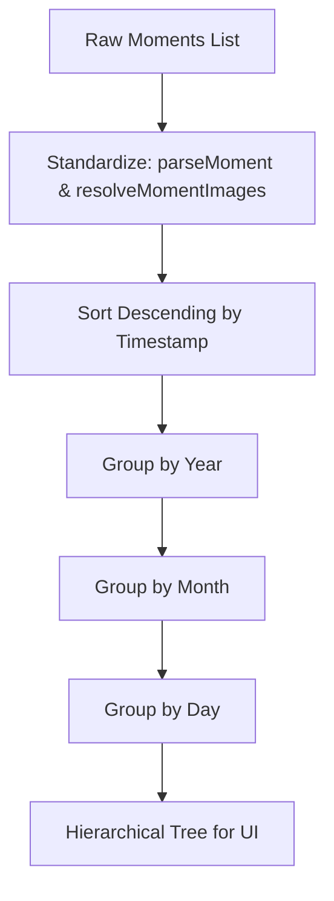
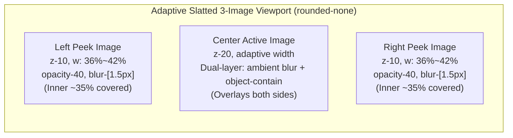

# 动态页面流光树状时间轴、三图格栅层叠轮播与晶透磨砂卡片逻辑文档 (Moments Timeline, Slatted 3-Image Carousel & Frosted Glassmorphism)

记录博客动态页（`/moments`）基于单 Markdown 文件数据源的多语言架构、多级树状分支时间轴几何算法、顶部年份快速筛选器、全比例画幅（含 9:16、3:4 竖图自适应）三图格栅层叠图片轮播组件（`MomentCarousel`）、大尺寸晶透磨砂圆角全局悬浮窗（`MomentLightbox`），以及晶透磨砂玻璃卡片（`.moment-card`）的美学设计与实现细节。

---

## 1. 详细实现原理与技术方案

### 1.1 数据结构与 Markdown 单文件维护机制

动态内容在 `/src/content/moments/<language>/moments.md`（如 `zh_cn/moments.md` 与 `en_us/moments.md`）下单文件集中维护。

#### Frontmatter 数据契约设计
每个 Markdown 文件通过 YAML frontmatter 维护 `moments` 动态列表，支持灵活的时间格式：
- **组合式写法**：直接通过 `date: "YYYY-MM-DD HH:mm"` 统一录入（例如 `"2026-09-15 14:30"`）。
- **字段式写法**：显式提供 `year`、`month`、`day`、`time`。
- **图片字段（可选）**：`images: []`，支持为空或包含多张图片文件名（如 `photo-1.svg`、`photo-2.svg`）或完整外部图片 URL。图片物理存放于当前语言目录同级的 `images/` 子目录下（例如 `src/content/moments/zh_cn/images/`）。
- **正文字段**：`content` 维护动态段落，支持行内代码块（\`code\`）与超链接。
- **扩展属性（可选）**：支持 `tags`（字符串数组）与 `mood`（状态徽章字符串）。

```markdown
---
moments:
  - date: "2026-09-15 14:30"
    year: 2026
    month: 9
    day: 15
    time: "14:30"
    images:
      - "photo-1.svg"
      - "photo-2.svg"
      - "photo-3.svg"
    content: "完成了博客动态页的全新美学重构！升级为流光时间轴与极简晶透磨砂玻璃卡片，支持三图格栅层叠与大尺寸磨砂圆角悬浮窗预览。"
  - date: "2026-09-12 09:15"
    images:
      - "photo-2.svg"
    content: "优化了文章详情页的侧边目录导航栏，无论视口如何快速滑动，目录始终保持在屏幕几何正中央，滑动平滑自然。"
---
```

#### Astro Content Layer Collection 集成 (`src/content.config.ts`)
```typescript
const moments = defineCollection({
  loader: glob({ pattern: '**/*.{md,mdx}', base: './src/content/moments' }),
  schema: z.object({
    moments: z
      .array(
        z.object({
          date: z.string().optional(),
          year: z.number().optional(),
          month: z.number().optional(),
          day: z.number().optional(),
          time: z.string().optional(),
          content: z.string(),
          tags: z.array(z.string()).default([]),
          mood: z.string().optional(),
          images: z.array(z.string()).nullish().transform((val) => val ?? []),
        })
      )
      .default([]),
  }),
});
```

---

### 1.2 树状层级构建算法 (`src/utils/moments.ts`)

为了构建逻辑清晰的「年份主轴 -> 月份分支 -> 日期分叉 -> 动态卡片」拓扑结构，设计了四级树状嵌套数据模型：
`YearMoments -> MonthMoments -> DayMoments -> MomentItem[]`



1. **时间标准化与降序排列**：通过正则表达式解析 `date` 字符串并生成 Unix 时间戳 `timestamp`，执行全局降序排序，保证最新发布的动态处于顶部。
2. **多语言月份本地化**：根据当前 locale 自动格式化（`zh_cn` 显示为 `9月`、`8月`，`en_us` 显示为 `Sep`、`Aug`）。
3. **同日多发自动归并**：同一天内的多条动态自动归并至同一日期徽章下，按时间戳倒序纵向堆叠。

---

### 1.3 动态图片资源静态解析算法 (`resolveMomentImages`)

动态引用的图片存放于各语言对应的 `images/` 子目录中。为使 Vite/Astro 在静态打包编译时正确处理并打包哈希资源，在 `src/utils/moments.ts` 中采用 `import.meta.glob` 深度预索引：

```typescript
const momentImages = import.meta.glob<{ default: ImageMetadata }>(
  '/src/content/moments/**/*.{png,jpg,jpeg,webp,svg,gif,avif}',
  { eager: true }
);

export function resolveMomentImages(locale: string, images?: string[]): string[] {
  if (!images || !Array.isArray(images) || images.length === 0) return [];

  return images
    .map((imgName) => {
      if (!imgName || typeof imgName !== 'string') return '';
      const trimmed = imgName.trim();
      if (trimmed.startsWith('http://') || trimmed.startsWith('https://')) {
        return trimmed;
      }
      const cleanName = trimmed
        .replace(/^[/\\]+/, '')
        .replace(/^images[/\\]+/i, '');

      const key = `/src/content/moments/${locale}/images/${cleanName}`;
      const resolved = momentImages[key]?.default?.src;
      if (resolved) {
        return resolved;
      }
      return `/src/content/moments/${locale}/images/${cleanName}`;
    })
    .filter(Boolean);
}
```

---

### 1.4 三图格栅层叠轮播与大尺寸磨砂圆角悬浮窗 (`MomentCarousel` & `MomentLightbox`)

#### 1.4.1 流内紧凑阅读与大尺寸磨砂圆角悬浮窗（React Portal）
卡片内尺寸严格克制，避免阻断正文通读；同时提供全局独立的悬浮窗大图观赏能力：
1. **流内紧凑高度**：根据当前主图比例自适应调节（竖图约 `245px~280px`，方图约 `210px~235px`，横图约 `185px~215px`），直角工坊画廊风格（`rounded-none`），节省垂直阅读空间。
2. **大尺寸晶透磨砂圆角悬浮窗 (`MomentLightbox` 挂载至 `document.body`)**：
   - 彻底摆脱 `.moment-card` 父容器的 `backdrop-filter` 与 `overflow-hidden` 包含块限制；
   - 通过 `createPortal(..., document.body)` 脱离局部 DOM 树，成为全视口独立顶级浮层；
   - **大尺寸剧场级视口**：容器尺寸大幅扩展至 `w-[96vw] max-w-[1380px] h-[92vh] sm:h-[94vh]`，图片展现范围扩展至 `max-w-[92vw] max-h-[76vh] sm:max-h-[80vh]`；
   - **浅色半透明磨砂玻璃圆角设计语言**：
     - 悬浮窗外壳采用浅色半透明高饱和磨砂质感：`rounded-3xl bg-white/45 dark:bg-white/35 backdrop-blur-3xl backdrop-saturate-150 border border-white/70 shadow-[0_30px_90px_rgba(0,0,0,0.2),inset_0_1px_2.5px_rgba(255,255,255,0.95)]`；
     - 顶部保留极细微高光反光晶面（`h-[1px] bg-gradient-to-r from-transparent via-white/90 to-transparent`）；
     - **彻底移除顶部分割线**：顶栏与画布融为一体（无 `border-b`），消除硬生生截断感；
     - 居中绝对定位计数胶囊：采用通透白晶磨砂小胶囊（`absolute left-1/2 -translate-x-1/2 rounded-full bg-white/65 border border-white/80 text-neutral-800`）；
     - 右侧圆形磨砂关闭按钮（`w-9 h-9 rounded-full bg-white/60 hover:bg-white/90 border border-white/80 text-neutral-700`）；
     - 画布彻底去除黑底遮罩（`bg-transparent`），图片带轻度圆角与深邃投影（`rounded-2xl shadow-[0_20px_50px_rgba(0,0,0,0.22)] border border-white/60`）；
     - 两侧浮现大圆形透亮磨砂翻页按钮（`w-12 h-12 rounded-full bg-white/70 hover:bg-white/95 border border-white/80 text-neutral-800`），支持键盘左右箭头与点击快捷翻页。

#### 1.4.2 竖图（9:16、3:4、1:2）与全比例自适应解法
常规横向轮播对竖图使用 `object-cover` 会导致头部与脚部被暴力裁切超 60%~70%。针对这一痛点，组件引入了**画幅感知与双层渲染引擎**：
1. **真实画幅感知**：通过 `Image()` 对象在挂载阶段侦测每张图片的原始宽高比（`ratio = naturalWidth / naturalHeight`），区分为竖图（`< 0.9`）、方图（`0.9 ~ 1.18`）与横图（`> 1.18`）。
2. **中间主图双层结构**：
   - **底层环境高斯模糊 (`object-cover blur-lg opacity-35 scale-110`)**：根据图片自身色彩生成柔光弥散背景，填满中心卡片，消除生硬的纯黑或纯白缝隙。
   - **顶层完整比例展示 (`object-contain rounded-none`)**：竖长图（如 9:16 自拍）、超宽图（如 21:9 宽屏）100% 完整展现构图与字迹，绝无任何暴力裁切。
3. **动态卡片宽度与容器高度弹性过渡**：
   - 当主图为竖图时，容器高度舒展至 `h-[245px] sm:h-[280px]`，中间卡片宽度收拢为 `w-[44%] sm:w-[48%]`，呈现挺拔立体的肖像相片质感；
   - 伴随 `transition-[height] duration-300 ease-out` 实现丝滑的跨比例高度自适应。
4. **单图模式（`total === 1`）**：
   - 彻底脱离横向卡槽约束，采用自适应居中容器（`max-h-[260px] sm:max-h-[300px] w-auto max-w-full object-contain`），竖图自然立起，横图自然延展。

#### 1.4.3 三图格栅层叠布局模型
当图片数量 $\ge 3$ 时，一次性同屏展示 3 张图片：
- **中间主图 (`currentIndex`)**：层级 `z-20`，位于最上层，双层画幅自适应，带有细白高光边框与投影，点击打开大尺寸全局悬浮窗。
- **左右微窥视图片 (`prevIndex` / `nextIndex`)**：层级 `z-10`，向中轴收缩，左右两侧各约 35% 面积被中间主图遮挡，呈现**百叶窗/格栅状重叠**；赋予半透明与轻微高斯模糊（`opacity-40 blur-[1.5px]`），悬停提亮，点击直接切换。
- **硬朗直角（流内相纸质感）**：卡片流内的多图与视口容器均配置 `rounded-none`。



#### 1.4.4 小红书同款严格居中 7 颗圆点指示器
在格栅视口下方，继续挂载三槽位绝对居中指示器（`flex-1` 左对齐 + `shrink-0` 中心高亮点 + `flex-1` 右对齐），即使处于首尾非对称状态（如第 1 张图），高亮圆点也稳固锚定在 50% 几何水平中心线上，离中心越远的点尺寸与透明度逐级衰减。

---

### 1.5 顶部年份快速索引切换器

当动态跨越多年度时，在内容区顶部提供响应式年份导航胶囊：
- **选项结构**：`全部 (Total)`、`2026 (4)`、`2025 (4)` 等。
- **状态流转**：基于 React 状态 `selectedYear: number | 'all'`，触发 `filteredTree` 的动态过滤。
- **选中样式**：深黑胶囊微缩放加权（`bg-neutral-900 text-white shadow-xs scale-[1.02]`），未选中项保持磨砂半透明悬停感。

---

### 1.6 流光时间轴与严格物理引线对齐算法

原黑曜石草图使用生硬的黑实线，新版升级为带有轻微弥散光晕的**流光时间轴**，并确保所有分支具有明确的几何对齐逻辑：

1. **主脊柱绝对定位**：
   - 垂直流光主干定位于 `left: 15px sm:left: 17px`。
   - 采用线性透明度流光渐变：`bg-gradient-to-b from-sky-400/60 via-indigo-400/35 to-sky-300/10`，并带有 `shadow-[0_0_8px_rgba(56,189,248,0.25)]`。
2. **月份中心节点**：
   - 月份徽章左侧的流光圆环微节点定位于 `-left-[19px] sm:-left-[21px]`，其几何中心精确重合在脊柱中轴线上。
3. **日期徽章与水平分叉微引线**：
   - 在时间轴脊柱上生成微节点（`w-2.5 h-2.5 rounded-full bg-white border-2 border-sky-400/80`）。
   - 通过极细半透明水平引线（`w-3.5 sm:w-4 h-[1px] bg-sky-400/40`）直抵日期胶囊（纯数字如 `[ 25 ]`，去除多余“日”字，高度精简聚焦），彻底杜绝节点浮空失联感。

---

### 1.7 极简晶透磨砂卡片设计 (`.moment-card`)

卡片完全纳入整站**晶透磨砂玻璃（Frosted Glass）**体系，信息架构自上而下自然流淌：

| 构件区域 | 布局与样式 | 视觉目标与设计权衡 |
| :--- | :--- | :--- |
| **顶部高光线** | `h-[1px] bg-gradient-to-r from-transparent via-white/80 to-transparent` | 物理倒角镜面反光质感 |
| **三图格栅展示区** | 位于正文上方，画幅自适应，`rounded-none` | 一次展示 3 张，竖图完整不截断，左右半透微模糊遮挡；点击主图唤起全局悬浮窗 |
| **指示器** | 居中三槽位最多 7 颗圆点 | 精致滑动反馈，高亮点绝对居中 |
| **正文文字** | `text-[14px] sm:text-[14.5px] leading-relaxed text-neutral-800` | 高对比度舒适排版，支持行内代码高亮与自动识别超链接 |
| **右下角时间** | `mt-2.5 pt-1 flex items-center justify-end font-mono text-xs text-neutral-500` | **删除时间 Emoji/时钟图标**，纯文本等宽排版，无视觉喧宾夺主，平稳收底 |
| **博主信息** | 完全移除头像与 ID | 消除单人博客每张卡片机械重复展示个人信息的冗余噪声 |

---

## 2. 踩坑点与 Bug 修复记录

### 2.1 Tailwind `space-y` 导致树枝连线断裂成浮空虚线
- **现象**：初次实现时，月份与日期节点之间出现了断续的短线段和空白缺口。
- **根本原因**：
  父容器使用了 `space-y-5`，会在子元素上附加 `margin-top: 1.25rem`。子元素的绝对定位垂直线（`top-0 bottom-0`）仅计算子元素自身高度，无法跨越外边距的空白，导致两段线之间产生 20px 物理断裂。
- **修复方案**：
  废弃外边距间隔，改用子元素内边距占位（`pl-* pb-5 sm:pb-6 last:pb-0`），垂直线从 0 到 100% 覆盖包括 padding 在内的全部空间。

---

### 2.2 最后一项日期垂线下坠出界
- **现象**：当月最后一天动态下方仍有一条突兀的竖线下垂至卡片底部。
- **根本原因**：
  在最后一项没有限定垂直高度，导致垂线直接穿过最后一条动态卡片高度。
- **修复方案**：
  对 `isLastDay` 分支进行条件约束：最后一天高度严格锁定为水平线高度 `h-[14px]`，与水平分支线形成闭合直角拐角。

---

### 2.3 多语言切换动态总数与侧边栏未联动
- **现象**：切换语言后，主面板动态内容切换为英文，但侧边栏和主标题处的总数仍停留在中文默认值。
- **根本原因**：
  客户端 `naph130:lang-change` 事件仅驱动了局部组件更新，未将统计数据哈希表传导给侧边栏。
- **修复方案**：
  1. 在 `getAllLocaleMoments()` 中统计各语言的 `totalCount`。
  2. 将 `statsByLocale` 扩充 `momentCount` 字段并透传给 `BlogSidebar` 与 `PageHeader`。
  3. `BlogSidebar` 内部监听语言变更后，自动计算 `currentMomentCount`，实现无缝动态响应。

---

### 2.4 纯黑黑曜石卡片与整站磨砂视觉割裂
- **现象**：在整站通透轻盈的磨砂玻璃与明亮壁纸中，动态卡片呈现大块沉重黑斑（`bg-neutral-900`），如同玻璃窗上的黑色膏药。
- **根本原因**：
  早期实现过度参照了特定暗色手绘草图方案，忽视了全站 SSOT 磨砂玻璃设计系统的统一性。
- **修复方案**：
  全面重构为 `.moment-card`，采用 `bg-white/24` + `backdrop-blur(28px)` + 顶部白色微高光反光，与整站其他页面（文章、简介、侧边栏）达到同层级的高光磨砂质感。

---

### 2.5 时间轴与日期胶囊脱节悬空问题
- **现象**：时间轴垂直流光线与日期徽章之间存在数十像素的空白盲区，日期胶囊仿佛悬挂在空中。
- **根本原因**：
  父级 `pl-*` 与绝对定位线坐标叠加失衡，且脊柱与日期徽章之间缺少物理分叉引线。
- **修复方案**：
  精准对齐时间轴垂直基准线（`left: 16px`），在脊柱对应位置绘制发光微节点，并引出微米级水平引线（`w-3.5 sm:w-4 h-[1px] bg-sky-400/40`）与日期胶囊相接，建立严谨的拓扑分支感。

---

### 2.6 卡片信息密度与冗余组件清洗
- **现象**：卡片内部塞入心情胶囊、底部标签条、复制/点赞按钮组、底部日期行，以及每张卡片顶部均机械重复展示博主个人头像与 ID，造成视觉凌乱拥挤，如同多用户社交网络的信息流。
- **根本原因**：
  个人博客场景下所有动态均为博主本人发布，每张卡片展示头像与昵称属于冗余噪声；过度叠加微交互功能亦破坏了动态流“轻便、纯净、随想”的核心诉求。
- **修复方案**：
  彻底剥离博主头像、昵称、心情胶囊、底部标签栏与底部操作条，聚焦正文排版与极简晶透磨砂质感，留白舒展自然。

---

### 2.7 Markdown 中动态图片打包与 Vite Glob 资源解析
- **现象**：在 `moments.md` 的 YAML frontmatter 中添加 `images: ["photo-1.svg"]` 并在 `img` 标签直接引用 `/src/content/moments/zh_cn/images/photo-1.svg` 时，生产环境打包（`astro build`）后图片 404 无法加载。
- **根本原因**：
  Astro Content Layer 仅解析 Markdown 的元数据，不会自动把 Frontmatter 字符串数组里的本地源码路径转换为生产打包后的带有 content hash 的静态资源 URL。
- **修复方案**：
  在 `src/utils/moments.ts` 中通过 `import.meta.glob<{ default: ImageMetadata }>('/src/content/moments/**/*.{...}', { eager: true })` 建立静态引用映射字典。在数据解析阶段调用 `resolveMomentImages(locale, item.images)`，将文件名规范化并替换为打包后的真实 `default.src`。

---

### 2.8 小红书指示器在首尾边界时中心高亮圆点横向漂移
- **现象**：当处于第 1 张图片（索引 0）时，左侧 0 颗，右侧 3 颗点，此时如果直接使用普通的 `flex justify-center gap-1.5`，高亮圆点会被右侧的 3 颗点挤向左侧，脱离屏幕几何正中心；移动端切换时圆点左右晃动，视觉体验不稳定。
- **根本原因**：
  常规 flex 居中计算的是「所有圆点构成的集合包围盒」的中点，而在非对称点数下，包围盒中点不等于高亮圆点的位置。
- **修复方案**：
  引入**三槽位布局**：左侧槽位 `flex-1 justify-end`，右侧槽位 `flex-1 justify-start`，中间高亮点独立为 `shrink-0`。两个 `flex-1` 强制平分两侧宽度，高亮点始终锁定在精确的 50% 几何中线。

---

### 2.9 时间戳从卡片右上角转移至右下角与 Emoji 剥离
- **现象**：右上角放置时间戳容易与多图轮播的 `1/8` 角标产生拥挤；且附带 Emoji 或时钟图标时，会打破正文字符的静谧极简感。
- **根本原因**：
  动态阅读动线自上而下，右上角视觉重心过重；图标色彩会分散正文注意力。
- **修复方案**：
  将时间戳下移至右下角，完全移除时钟图标与 Emoji，仅保留等宽灰调纯文本（`text-xs font-mono text-neutral-500 font-medium`），纯净优雅。

---

### 2.10 流内大图阻断阅读与全屏灯箱（Lightbox）双层平衡
- **现象**：在单卡片中一次展示 400px+ 纵向高度的图片会严重阻断正文的阅读视线，移动端一屏内只能看到半张图，用户需要反复滚动才能阅读一句简短的动态文字。
- **根本原因**：
  动态页的定位是“随笔与生活片段”，图文兼备但以内容通读为先，不宜直接套用纯摄影站的超大画幅模式。
- **修复方案**：
  1. 卡片内采用紧凑自适应视口与三图格栅层叠展示，文字始终保留在显要视觉区内；
  2. 结合 `MomentLightbox`，点击主图一键唤起大尺寸磨砂圆角悬浮窗查看原图，实现“日常通读轻巧舒畅、高清细看原画沉浸”。

---

### 2.11 竖向图片（9:16、3:4、1:2）在固定横向视口中被暴力裁切失真
- **现象**：当动态中包含手机竖拍或竖版海报图片时，若直接使用固定横向盒模型（如 `w-full h-[200px] object-cover`），竖图会被放大 3~5 倍强制填充，导致上下 70% 的画面（人物头部、文字标识、主体细节）被硬生生切掉，只留下无法辨识的局部色块。
- **根本原因**：
  固定宽高比容器 + `object-cover` 是典型的“横图假定”，完全忽视了移动端时代 9:16 肖像图与长图的天然纵向形态。
- **修复方案**：
  1. **单图模式自适应**：废除固定的横向大宽高强制限制，改为 `max-h-[260px] sm:max-h-[300px] w-auto max-w-full object-contain`，使单张竖图自然以原比例站立，两端留白舒展；
  2. **三图轮播画幅感知**：通过预载机制计算当前主图 `aspectRatio`，竖图时容器自动舒展至 `245px~280px`，主卡片收窄为 `44%~48%`；
  3. **双层环境填充渲染**：主图采用 `object-contain` 保证原图 100% 完整可视，底层叠加 `object-cover blur-lg opacity-35 scale-110` 柔和环境光影，彻底杜绝黑边白边与暴力裁切。

---

### 2.12 `backdrop-filter` 与 `overflow-hidden` 导致 `position: fixed` 模态框被局限在卡片内
- **现象**：点击图片放大时，弹出的 Lightbox 并不是铺满全屏幕的浮层，而是被“困”在单独一张动态卡片内，并且边缘被截断，无法正常展开到全屏。
- **根本原因**：
  根据 W3C CSS 规范，当祖先元素设置了 `backdrop-filter`、`transform`、`filter` 或 `perspective` 时，会创建一个**全新的定位包含块（Containing Block）**。这意味着其子元素的 `position: fixed; inset: 0` 不再相对于视口（`window`）计算，而是被迫相对于该祖先元素定位；加之卡片本身具有 `overflow: hidden`，导致固定定位层直接被卡片盒模型截断。
- **修复方案**：
  使用 `createPortal(content, document.body)` 将悬浮窗直接挂载至 `document.body` 根节点下，彻底摆脱所有卡片局部层叠上下文与裁剪规则，同时升级为大尺寸剧场级磨砂玻璃圆角悬浮窗（`rounded-3xl`、`w-[96vw]`、顶部晶透高光镜面与圆形磨砂控件）。
