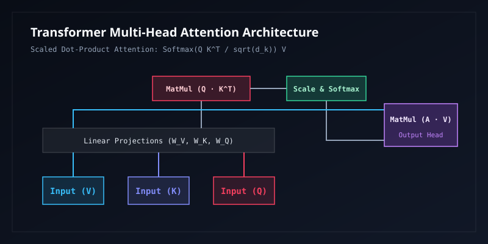

## 1. Neural Networks & Gradient Backpropagation

Modern deep neural networks fit complex manifold mappings across high-dimensional latent spaces through composite affine transformations and non-linear activations.

### 1.1 Forward Pass & Layer Composition

Let the input to layer $l$ be $\mathbf{a}^{[l-1]}$, the pre-activation linear combination be $\mathbf{z}^{[l]}$, and the post-activation output via non-linear mapping $\sigma(\cdot)$ be:

$$
\mathbf{z}^{[l]} = \mathbf{W}^{[l]} \mathbf{a}^{[l-1]} + \mathbf{b}^{[l]}, \quad \mathbf{a}^{[l]} = \sigma(\mathbf{z}^{[l]})
$$

where $\mathbf{W}^{[l]} \in \mathbb{R}^{n_l \times n_{l-1}}$ denotes the learnable weight tensor, and $\mathbf{b}^{[l]} \in \mathbb{R}^{n_l}$ is the bias vector.

### 1.2 Chain Rule & Backpropagation Equations

Applying the multivariable chain rule from calculus, the error sensitivity term $\boldsymbol{\delta}^{[l]}$ with respect to pre-activation $\mathbf{z}^{[l]}$ propagates recursively:

$$
\boldsymbol{\delta}^{[l]} \triangleq \frac{\partial \mathcal{L}}{\partial \mathbf{z}^{[l]}} = \left( (\mathbf{W}^{[l+1]})^T \boldsymbol{\delta}^{[l+1]} \right) \odot \sigma'(\mathbf{z}^{[l]})
$$

From these error terms, the analytic gradients with respect to parameter matrices and biases follow:

$$
\begin{aligned}
\frac{\partial \mathcal{L}}{\partial \mathbf{W}^{[l]}} &= \boldsymbol{\delta}^{[l]} (\mathbf{a}^{[l-1]})^T \\
\frac{\partial \mathcal{L}}{\partial \mathbf{b}^{[l]}} &= \boldsymbol{\delta}^{[l]}
\end{aligned}
$$

## 2. Optimization Algorithms & Adaptive Momentum (Adam)

Adam (Adaptive Moment Estimation) combines the advantages of Momentum and RMSProp by tracking exponentially decaying averages of past gradients (first raw moment) and squared gradients (second uncentered moment):

### 2.1 Moving Averages & Bias Correction

At step $t$, given target parameters $\theta_t$ and stochastic mini-batch gradient $g_t = \nabla_\theta \mathcal{L}(\theta_t)$:

$$
\begin{aligned}
m_t &= \beta_1 m_{t-1} + (1 - \beta_1) g_t \\
v_t &= \beta_2 v_{t-1} + (1 - \beta_2) g_t^2
\end{aligned}
$$

Because $m_0 = 0$ and $v_0 = 0$, the estimators are biased toward zero in initial iterations. Applying analytic debiasing yields:

$$
\hat{m}_t = \frac{m_t}{1 - \beta_1^t}, \quad \hat{v}_t = \frac{v_t}{1 - \beta_2^t}
$$

The final parameter update formula becomes:

$$
\theta_{t+1} = \theta_t - \frac{\eta}{\sqrt{\hat{v}_t} + \epsilon} \hat{m}_t
$$

Standard default hyperparameters: learning rate $\eta = 10^{-3}$, decay factors $\beta_1 = 0.9$, $\beta_2 = 0.999$, and epsilon stabilizer $\epsilon = 10^{-8}$.

## 3. Transformer Architecture & Attention Mechanism

Self-Attention represents the foundational cornerstone of modern Large Language Models (LLMs).

### 3.1 Scaled Dot-Product Attention

Given query tensor $\mathbf{Q}$, key tensor $\mathbf{K}$, and value tensor $\mathbf{V}$, where $\mathbf{Q}, \mathbf{K} \in \mathbb{R}^{n \times d_k}$ and $\mathbf{V} \in \mathbb{R}^{n \times d_v}$:

$$
\text{Attention}(\mathbf{Q}, \mathbf{K}, \mathbf{V}) = \text{softmax}\left( \frac{\mathbf{Q} \mathbf{K}^T}{\sqrt{d_k}} \right) \mathbf{V}
$$

**Why divide by $\sqrt{d_k}$?** Assuming components of $\mathbf{q}$ and $\mathbf{k}$ are independent random variables with mean 0 and variance 1, the inner product $q \cdot k = \sum_{i=1}^{d_k} q_i k_i$ exhibits:

$$
\mathbb{E}[q \cdot k] = 0, \quad \text{Var}(q \cdot k) = \sum_{i=1}^{d_k} \text{Var}(q_i k_i) = d_k
$$

For large $d_k$, the variance scales proportionally, pushing softmax into regions of vanishing gradients. Scaling by $\frac{1}{\sqrt{d_k}}$ renormalizes the variance back to 1.

### 3.2 Multi-Head Attention

Multi-head attention projects inputs into multiple representation subspaces concurrently:

$$
\text{MultiHead}(\mathbf{Q}, \mathbf{K}, \mathbf{V}) = \text{Concat}(\text{head}_1, \dots, \text{head}_h) \mathbf{W}^O
$$

where each head computes independent attention:

$$
\text{head}_i = \text{Attention}(\mathbf{Q}\mathbf{W}_i^Q, \mathbf{K}\mathbf{W}_i^K, \mathbf{V}\mathbf{W}_i^V)
$$

with parameter dimensions $\mathbf{W}_i^Q \in \mathbb{R}^{d_{\text{model}} \times d_k}$, $\mathbf{W}_i^K \in \mathbb{R}^{d_{\text{model}} \times d_k}$, $\mathbf{W}_i^V \in \mathbb{R}^{d_{\text{model}} \times d_v}$, and output projection $\mathbf{W}^O \in \mathbb{R}^{h d_v \times d_{\text{model}}}$.

## 4. Loss Functions & Piecewise Formatting

Smooth $L_1$ Loss widely adopted in object detection:

$$
\text{Smooth}_{L_1}(x) = \begin{cases}
0.5 x^2, & \text{if } |x| < 1 \\
|x| - 0.5, & \text{otherwise}
\end{cases}
$$

Kullback-Leibler divergence (relative entropy) between continuous probability distributions:

$$
D_{\text{KL}}(P \parallel Q) = \int_{-\infty}^{+\infty} p(x) \ln\left( \frac{p(x)}{q(x)} \right) dx = \mathbb{E}_{x \sim P}\left[ \ln p(x) - \ln q(x) \right]
$$
