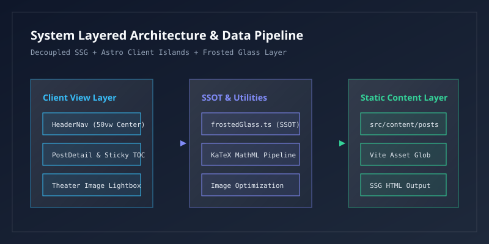

## 1. 项目架构概述

本项目基于 Astro 5 + React 19 + TailwindCSS 构建，采用了现代的前端工程化解耦设计，具备极佳的首屏加载性能与交互流畅度。


如上图所示，用户点击正文中的任何 Markdown 图片即可唤起剧院级晶透磨砂灯箱（Theater-scale Lightbox）进行全屏无损浏览，支持滚动手势、ESC 按键关闭及左右按键切图。



### 1.1 核心技术选型

在此次升级中，我们统一梳理了全局样式变量与组件设计规范：

| 模块 / 技术 | 版本 | 核心作用 | 备注 |
| :--- | :--- | :--- | :--- |
| **Astro** | `^5.0.0` | 静态孤岛架构与内容集合管理 | 零 JS 首屏性能 |
| **React** | `19.0.0` | 交互式客户端组件 (Islands) | `client:load` 按需挂载 |
| **TailwindCSS** | `v4 / 3.4` | 原子化实用工具类库 | 结合 Vanilla CSS 磨砂变量 |
| **Lucide React** | `^1.16.0` | 矢量图标库 | 统一视觉微标 |

### 1.2 目录与路由解析

路由采用了双层动态参数 `[...slug].astro`，支持分语言隔离索引：

```typescript
import { getCollection, render } from 'astro:content';
import { resolvePostCover, calculateReadingTime } from '@/utils/posts';

export async function getStaticPaths() {
  const allPosts = await getCollection('posts');
  return allPosts.map((post) => ({
    params: { slug: post.id.replace(/\/post(\.md)?$/, '') },
    props: { post },
  }));
}
```

在本地开发调试环境中，可以通过以下命令快速启动开发服务器：

```bash
# 启动本地热重载开发服务器
npm run dev -- --host
```

## 2. 界面设计规范与交互实现

### 2.1 磨砂玻璃质感

中间栏主卡片与右侧目录导航统一继承了全局磨砂玻璃设计规范：

> 磨砂玻璃卡片采用微饱和度与微亮度消除深色暗区发灰问题，具有极高的观赏度与视觉通透感。

### 2.2 目录平滑跳转与实时追踪

右侧目录具备以下特性：
- 自动层级编号（如 `1`, `1.1`, `1.2`, `2`, `2.1`）；
- 点击目录项平滑滚动至对应正文位置；
- 滚动页面时通过 `IntersectionObserver` 实时判定当前阅读位置，并以**蓝色高亮**指示。

## 3. 数学建模与 LaTeX 公式支持

文章正文排版引擎内置了基于 KaTeX 的数学公式渲染体系，完美支持行内数学符号与复杂多行块级公式的晶透卡片呈现。

### 3.1 行内公式与微积分符号

在段落中可以直接书写高质量行内公式：
- 经典质能等价关系：$E = mc^2$；
- 欧拉优美恒等式：$e^{i\pi} + 1 = 0$；
- 薛定谔微观波动方程：$i\hbar \frac{\partial}{\partial t}\Psi(\mathbf{r}, t) = \hat{H}\Psi(\mathbf{r}, t)$；
- 机器学习交叉熵损失函数：$L(\theta) = -\frac{1}{N}\sum_{i=1}^N \left[ y_i \ln \hat{y}_i + (1 - y_i)\ln(1 - \hat{y}_i) \right]$。

### 3.2 块级公式与积分变换

高斯积分（Euler-Poisson 积分）在实数全域上的解析解：

$$
\int_{-\infty}^{+\infty} e^{-x^2} dx = \sqrt{\pi}
$$

连续傅里叶正反变换对（Continuous Fourier Transform）：

$$
\mathcal{F}(\omega) = \frac{1}{\sqrt{2\pi}} \int_{-\infty}^{+\infty} f(t) e^{-i\omega t} dt, \quad f(t) = \frac{1}{\sqrt{2\pi}} \int_{-\infty}^{+\infty} \mathcal{F}(\omega) e^{i\omega t} d\omega
$$

### 3.3 经典场论与对齐公式组 (Aligned System)

麦克斯韦经典电磁方程组（Maxwell's Equations）微分形式：

$$
\begin{aligned}
\nabla \cdot \mathbf{E} &= \frac{\rho}{\varepsilon_0} \\
\nabla \cdot \mathbf{B} &= 0 \\
\nabla \times \mathbf{E} &= -\frac{\partial \mathbf{B}}{\partial t} \\
\nabla \times \mathbf{B} &= \mu_0 \mathbf{J} + \mu_0 \varepsilon_0 \frac{\partial \mathbf{E}}{\partial t}
\end{aligned}
$$

### 3.4 矩阵代数与深度学习注意力机制

实数域上的高维矩阵参数化表示：

$$
\mathbf{W} = \begin{pmatrix}
w_{11} & w_{12} & \cdots & w_{1n} \\
w_{21} & w_{22} & \cdots & w_{2n} \\
\vdots & \vdots & \ddots & \vdots \\
w_{m1} & w_{m2} & \cdots & w_{mn}
\end{pmatrix} \in \mathbb{R}^{m \times n}
$$

Transformer 架构中的缩放点积注意力机制（Scaled Dot-Product Attention）：

$$
\text{Attention}(Q, K, V) = \text{softmax}\left( \frac{Q K^T}{\sqrt{d_k}} \right) V
$$

当公式宽度超出屏幕阅读宽度时，卡片底层自动启用横向平滑滚动条，确保在移动端和窄屏视口下拥有始终完美的阅读与交互体验。

