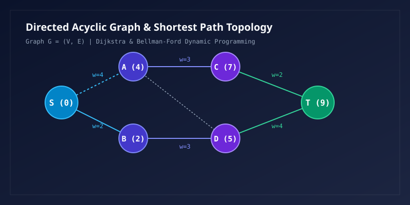

## 1. 渐近分析与分治递归主定理

算法渐近时间复杂度分析是评估计算效率的核心工具。分治算法的递推关系式通常可表示为标准递归形式：

$$
T(n) = a T\left( \frac{n}{b} \right) + f(n)
$$

其中 $a \ge 1$ 为子问题分支数，$b > 1$ 为问题规模缩减因子，$f(n)$ 为划分与合并操作的渐近耗时。

### 1.1 临界指数与三种渐近情形

定义临界指数 $c_{\text{crit}} = \log_b a$，将 $f(n)$ 与多项式基底 $n^{c_{\text{crit}}}$ 进行比较：

$$
T(n) = \begin{cases}
\Theta\left( n^{\log_b a} \right), & \text{若 } f(n) = O\left( n^{\log_b a - \epsilon} \right), \, \epsilon > 0 \\
\Theta\left( n^{\log_b a} \log^{k+1} n \right), & \text{若 } f(n) = \Theta\left( n^{\log_b a} \log^k n \right), \, k \ge 0 \\
\Theta\left( f(n) \right), & \text{若 } f(n) = \Omega\left( n^{\log_b a + \epsilon} \right) \text{ 且满足正则条件}
\end{cases}
$$

例如归并排序（Merge Sort）中 $a=2, b=2, f(n)=\Theta(n)$，因 $\log_2 2 = 1$，属于第二类情形（$k=0$），得出严谨渐近界 $T(n) = \Theta(n \log n)$。

## 2. 图论拓扑与最短路径动态规划

在赋权有向图 $G = (V, E)$ 中，寻找源点 $s$ 到所有顶点的单源最短路径依赖于松弛操作（Edge Relaxation）。

### 2.1 贝尔曼-福特方程与最优子结构

设 $d(v)$ 为源点到顶点 $v$ 的最短距离估计值，对任意边 $(u, v) \in E$，动态规划 Bellman 最优性方程为：

$$
d[v] = \min \left\{ d[v], \, \min_{(u, v) \in E} (d[u] + w(u, v)) \right\}
$$

弗洛伊德算法（Floyd-Warshall）则通过以顶点 $k$ 为中间节点的动态规划解决全源最短路径：

$$
d_{ij}^{(k)} = \min\left( d_{ij}^{(k-1)}, \, d_{ik}^{(k-1)} + d_{kj}^{(k-1)} \right)
$$

## 3. 组合数学与卡特兰数 (Catalan Numbers)

卡特兰数出现在大量计数问题中（如凸多边形三角剖分、合法括号匹配数、满二叉树形态计数）。

### 3.1 闭式通项与递归生成函数

卡特兰数 $C_n$ 的标准封闭形式及二项式展开表达式为：

$$
C_n = \frac{1}{n+1} \binom{2n}{n} = \frac{(2n)!}{(n+1)! \, n!} = \prod_{k=2}^n \frac{n+k}{k}
$$

其满足卷积型递推关系式：

$$
C_0 = 1, \quad C_{n+1} = \sum_{i=0}^n C_i C_{n-i}
$$

通过生成函数 $G(x) = \sum_{n=0}^\infty C_n x^n$，方程转化为二次代数方程 $x G(x)^2 - G(x) + 1 = 0$，解出解析式：

$$
G(x) = \frac{1 - \sqrt{1 - 4x}}{2x}
$$

## 4. 代数图论与图拉普拉斯矩阵

设简单无向无权图的度数对角矩阵为 $\mathbf{D}$，邻接矩阵为 $\mathbf{A}$，其非归一化图拉普拉斯矩阵定义为：

$$
\mathbf{L} \triangleq \mathbf{D} - \mathbf{A}
$$

对称归一化拉普拉斯矩阵（Symmetric Normalized Laplacian）具有良好的半正定谱特性：

$$
\mathbf{L}_{\text{sym}} = \mathbf{D}^{-1/2} \mathbf{L} \mathbf{D}^{-1/2} = \mathbf{I} - \mathbf{D}^{-1/2} \mathbf{A} \mathbf{D}^{-1/2}
$$

其特征值谱满足 $0 = \lambda_1 \le \lambda_2 \le \dots \le \lambda_n \le 2$，其中第二小特征值 $\lambda_2$ 即为著名的代数连通度（Fiedler 值），在谱聚类与图神经网络（GCN）图卷积核设计中起决定性作用。
