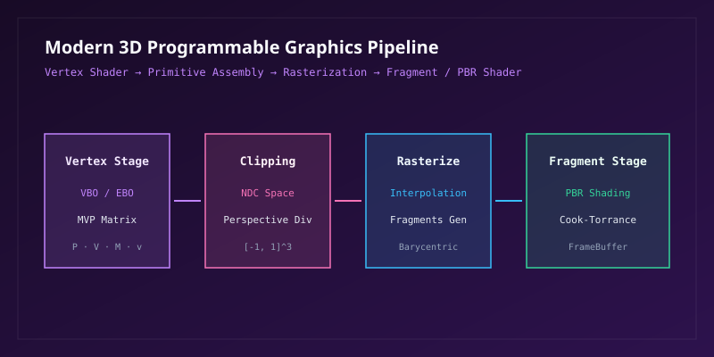

## 1. 齐次坐标与 3D 空间变换矩阵体系

三维图形学通过引入四维齐次坐标（Homogeneous Coordinates），将空间仿射平移、三维旋转与非线性透视投影统一在 $4 \times 4$ 矩阵代数框架内。

### 1.1 MVP 复合变换矩阵 (Model-View-Projection)

顶点在空间中的流水线位置投影遵循：

$$
\mathbf{v}_{\text{clip}} = \mathbf{M}_{\text{MVP}} \cdot \mathbf{v}_{\text{local}} = (\mathbf{P} \cdot \mathbf{V} \cdot \mathbf{M}) \cdot \begin{pmatrix} x \\ y \\ z \\ 1 \end{pmatrix}
$$

其中透视投影矩阵 $\mathbf{P}$ 将视锥体压缩为规范化设备坐标（NDC, Normalized Device Coordinates）：

$$
\mathbf{P} = \begin{pmatrix}
\frac{1}{\tan(\theta/2) \cdot r} & 0 & 0 & 0 \\
0 & \frac{1}{\tan(\theta/2)} & 0 & 0 \\
0 & 0 & -\frac{f + n}{f - n} & -\frac{2fn}{f - n} \\
0 & 0 & -1 & 0
\end{pmatrix}
$$

式中 $\theta$ 为垂直视场角（FOV），$r$ 为宽高比（Aspect Ratio），$n$ 和 $f$ 分别为近平面与远平面裁剪距离。

## 2. 现代可编程图形渲染管线

现代图形 API（Vulkan、DirectX 12、WebGPU）将 GPU 执行流组织为多阶段协同工作流水线。

### 2.1 阶段数据传递与重心坐标插值

在图元光栅化（Rasterization）阶段，三角形内部任意离散片段的属性（如 UV 坐标、法线 $\mathbf{n}$、切线 $\mathbf{t}$）通过重心坐标 $(\alpha, \beta, \gamma)$ 进行透视校正插值：

$$
\mathbf{p} = \alpha \mathbf{v}_1 + \beta \mathbf{v}_2 + \gamma \mathbf{v}_3, \quad \text{其中 } \alpha + \beta + \gamma = 1, \; \alpha, \beta, \gamma \ge 0
$$

## 3. 基于物理的渲染 (PBR) 与光照方程

现代真实感渲染的核心是基于能量守恒定律的 Kajiya 渲染方程。

### 3.1 渲染方程全形式 (The Rendering Equation)

半球立体角空间 $\Omega$ 上的连续辐射度积分表达式：

$$
L_o(\mathbf{p}, \omega_o) = L_e(\mathbf{p}, \omega_o) + \int_\Omega f_r(\mathbf{p}, \omega_i, \omega_o) L_i(\mathbf{p}, \omega_i) (\mathbf{n} \cdot \omega_i) \, d\omega_i
$$

其中 $L_e$ 为自发光辐射率，$f_r$ 为双向反射分布函数（BRDF），$L_i$ 为入射辐射率，$\mathbf{n} \cdot \omega_i = \cos\theta_i$ 为朗伯衰减项。

### 3.2 Cook-Torrance 微表面高光 BRDF 模型

Cook-Torrance 模型将双向反射率分解为漫反射（Diffuse）与镜面反射（Specular）两部分：

$$
f_r = k_d \frac{c}{\pi} + k_s \frac{D(\mathbf{h}) \, F(\omega_o, \mathbf{h}) \, G(\omega_i, \omega_o, \mathbf{h})}{4 (\mathbf{n} \cdot \omega_i) (\mathbf{n} \cdot \omega_o)}
$$

其中各微表面物理因子的解析公式为：
- **法线分布函数 (GGX/Trowbridge-Reitz $D$)**：
  $$
  D(\mathbf{h}) = \frac{\alpha^2}{\pi \left( (\mathbf{n} \cdot \mathbf{h})^2 (\alpha^2 - 1) + 1 \right)^2}
  $$
- **菲涅尔方程 (Fresnel-Schlick $F$)**：
  $$
  F(\omega_o, \mathbf{h}) = F_0 + (1 - F_0) \left( 1 - (\omega_o \cdot \mathbf{h}) \right)^5
  $$
- **几何阴影遮挡函数 (Smith $G$)**：
  $$
  G(\omega_i, \omega_o, \mathbf{h}) = G_1(\omega_i) \cdot G_1(\omega_o), \quad G_1(\mathbf{v}) = \frac{2 (\mathbf{n} \cdot \mathbf{v})}{(\mathbf{n} \cdot \mathbf{v}) + \sqrt{\alpha^2 + (1 - \alpha^2)(\mathbf{n} \cdot \mathbf{v})^2}}
  $$

## 4. 光线追踪求交解算 (Ray Tracing Intersection)

在光线追踪算法中，参数化光线 $\mathbf{r}(t) = \mathbf{o} + t \mathbf{d}$ 与中心在 $\mathbf{c}$、半径为 $R$ 的球体交点计算满足二次代数方程：

$$
(\mathbf{d} \cdot \mathbf{d}) t^2 + 2 \mathbf{d} \cdot (\mathbf{o} - \mathbf{c}) t + (\mathbf{o} - \mathbf{c}) \cdot (\mathbf{o} - \mathbf{c}) - R^2 = 0
$$

其判别式 $\Delta = b^2 - 4ac$ 决定了光线与球体的相交几何状态（$\Delta < 0$ 相离，$\Delta = 0$ 相切，$\Delta > 0$ 双交点）。
