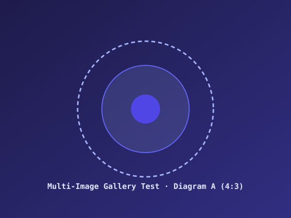
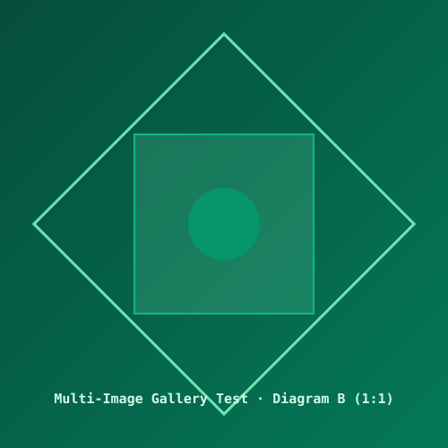

## 1. 连续多图与剧院级灯箱画廊切图测试

本小节放置了 3 张不同纵横比（16:9 封面、4:3 图表、1:1 正方形微架构）的 Markdown 图片。点击其中任意一张图片，即可唤起带有 `1 / 3`、`2 / 3`、`3 / 3` 计数指示的晶透磨砂剧院灯箱，支持点击左右白玉圆钮或键盘 `←` / `→` 键进行无缝流畅切图。

如上所示，图片不仅具备直角（`border-radius: 0`）与高透亮边框，且每张图片的下方均已通过客户端脚本自动提取 `alt` 内容生成等宽居中图注。

## 2. 极宽公式横向平滑滚动测试 (Horizontal Scroll Test)

当数学推导包含极长算子链、高维张量积或展开项时，公式宽度很容易超出正文主阅读卡片宽度。排版系统通过 `.katex-display` 的 `overflow-x: auto` 与专用 4px 晶透微滚动条，确保排版绝不发生折行错位或破框：

$$
\begin{aligned}
\Psi_{\text{total}}(x_1, \dots, x_n; t) &= \sum_{k=1}^N \alpha_k \int_{-\infty}^{+\infty} \frac{\sin(\omega_k \tau)}{\omega_k \tau} \exp\left( -i \left( \mathbf{k}_k \cdot \mathbf{x} - \omega_k t \right) \right) d\tau + \prod_{j=1}^M \left[ \beta_j \frac{\partial^2 \phi}{\partial x_j^2} + \gamma_j \left( \frac{\partial \phi}{\partial x_j} \right)^2 \right] \\
&\quad + \frac{1}{(2\pi)^{d/2} |\boldsymbol{\Sigma}|^{1/2}} \exp\left( -\frac{1}{2} (\mathbf{x} - \boldsymbol{\mu})^T \boldsymbol{\Sigma}^{-1} (\mathbf{x} - \boldsymbol{\mu}) \right) \cdot \left[ \mathbf{A} \otimes \mathbf{B} + (\mathbf{C} \oplus \mathbf{D})^{-1} \right]_{ij} \\
&\quad + \oint_{\Gamma} \frac{f(\zeta)}{(\zeta - z)^{m+1}} d\zeta + \sum_{p=1}^\infty \frac{(-1)^p}{(2p)!} \left( \nabla^2 \Phi(\mathbf{r}) \right)^{2p} + \sqrt[3]{\frac{\hbar^2}{2m} \left( \frac{\partial^2}{\partial x^2} + \frac{\partial^2}{\partial y^2} + \frac{\partial^2}{\partial z^2} \right) + V(\mathbf{r})}
\end{aligned}
$$

移动端与窄屏用户可以自如地横向拖拽滑动上方数学卡片，查看完整解析推导。

## 3. 富文本表格、行内公式与标签混排

测试在 Markdown 复杂数据表格中内嵌 LaTeX 数学符号、行内代码与徽章的排版表现：

| 算子类别 | 典型代表数学公式 | 矩阵 / 空间维度 | 算法收敛率 | 复杂度等级 |
| :--- | :--- | :--- | :--- | :--- |
| **一阶梯度算子** | $\mathbf{g}_t = \nabla_\theta \mathcal{L}(\theta_t)$ | $\mathbb{R}^d$ | $O(1/\epsilon^2)$ | `O(N)` 线性 |
| **牛顿海森矩阵** | $\mathbf{H}_{ij} = \frac{\partial^2 \mathcal{L}}{\partial \theta_i \partial \theta_j}$ | $\mathbb{R}^{d \times d}$ | $O(\log(1/\epsilon))$ | `O(N^3)` 三次 |
| **缩放注意力** | $\text{Softmax}\left(\frac{QK^T}{\sqrt{d_k}}\right)$ | $\mathbb{R}^{L \times L}$ | 恒等映射 | `O(L^2)` 二次 |
| **图拉普拉斯** | $\mathbf{L} = \mathbf{D} - \mathbf{A}$ | $\mathbb{R}^{|V| \times |V|}$ | 谱间隙 $\lambda_2$ | `O(|V| + |E|)` |

## 4. 块引用 (Blockquote) 与深层嵌套公式

> **理论评注与引理**：  
> 在任意赋范线性空间中，柯西-施瓦茨不等式（Cauchy-Schwarz Inequality）恒成立：
> 
> $$
> |\langle \mathbf{u}, \mathbf{v} \rangle|^2 \le \langle \mathbf{u}, \mathbf{u} \rangle \cdot \langle \mathbf{v}, \mathbf{v} \rangle = \|\mathbf{u}\|^2 \|\mathbf{v}\|^2
> $$
> 
> 等号成立当且仅当 $\mathbf{u}$ 与 $\mathbf{v}$ 线性相关（即存在标量 $\lambda \in \mathbb{C}$ 使得 $\mathbf{u} = \lambda \mathbf{v}$）。

通过上述全方位的排版测试，文章详情展示页在各种复杂科学排版需求下均能保持稳固、清晰且高雅的现代极简视觉体验。
